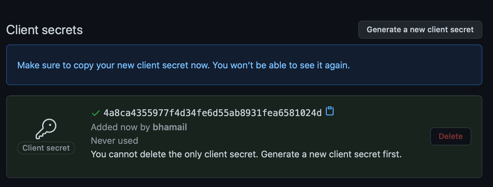

[](https://circleci.com/gh/sonatype-nexus-community/the-cla)
# THE-CLA

The-Cla is an app written in Golang/React for getting CLA signatures. This is just a proof of concept at time being, use at your own risk.

## Development

### Setup

To get started with this project you will need:

- Golang (project started using Go 1.16.2, but likely anything above 1.14 is fine)
- Yarn/NodeJS
- Air

To install air:

- https://github.com/cosmtrek/air

You can run:

- `go get -u github.com/cosmtrek/air` in a folder outside this project (so it is not added as a dependency)

### Running/Developing

Thanks to Air, there is some amount of "live-reload". To run the project, you can run `air -c .air.toml` in the project root. Once it is built, you should be able to access the site at `http://localhost:4200/`

Any code changes to golang/react files will cause a rebuild and restart, and will be accessible via the browser with a refresh!

For local development, a good first step is to copy the example `.env.example` file to `.env` and launch a local db
and `air` like so:
```shell
cp .example.env .env
make run-air
```

For some fun interactive debugging with [server.go](./server.go), you could spin up the local docker db image, and manually run
the server in debug more. See the [Makefile](./Makefile) for the latest and greatest commands to cherry-pick.
```shell
$ docker run --name the_cla_postgres -p 5432:5432 -e POSTGRES_PASSWORD=the_cla -e POSTGRES_DB=db -d postgres
34b413c68663b28d722fe2503b869a03bd2808e1facdcbbf5dde8a1ac0f6beb9...
```
Then run [server.go](./server.go) in debug mode in your favorite IDE, and enjoy break points activating when you connect to
endpoints. Wee!

#### Docker

Alternatively, if you just want to play around lightly, you can run the docker commands below. First set up
your environment as described in [App environment configuration](#app-environment-configuration), otherwise much may not
work, and you will miss out on much goodness.

- `make docker`
- `docker run -p 4200:4200 the-cla`

This will be a lot slower, but you can build and run the entire application with only `docker` (and `make`) installed, essentially.

## Deployment

### GitHub

#### GitHub oAuth Application

More to come! This is where we will explain how to set up the oauth app!

see: [Creating an OAuth App](https://docs.github.com/en/developers/apps/creating-an-oauth-app) for details on how to
register `the-cla` as a new oAuth application for your account on GitHub.

For local development, you can use an `Authorization callback URL` that points to your locally running app, 
like: `http://localhost:4200/`

When you register this new oAuth app, GitHub will generate a `Client ID`.
Edit your `.env` file, setting the `REACT_APP_GITHUB_CLIENT_ID` variable to your `Client ID`. The id will be a hash-like
value like `3babf7b58e69bbd53189`. Of course your value will be different.

After completing the steps above, you also need to generate a new `Client secret` for use during authentication.
Click the `Generate a new client secret` button, and set the resulting value to the `GITHUB_CLIENT_SECRET` variable. The
id will be a hash-like value like `4a8ca4355977f4d34fe6d55ab8931fea6581024d` (a little longer than the `Client ID`).
Of course your value will be different. 


#### App environment configuration

Configuration of `the-cla` is handled via a `.env` file in the repo (this is ignored by git by default, so you don't check in secrets):

A `.example.env` has been provided that looks similar to the following:

```
CLA_URL=https://s3.amazonaws.com/sonatype-cla/cla.txt
REACT_APP_COMPANY_NAME=Your company name
REACT_APP_CLA_APP_NAME=THE CLA
REACT_APP_GITHUB_CLIENT_ID=fake_ID
REACT_APP_CLA_VERSION=1.0
GITHUB_CLIENT_SECRET=fake_Secret
GH_WEBHOOK_SECRET=totallysecret
GH_APP_ID=1337
```

The important things to update are:

- `CLA_URL` - this is a txt file hosted somewhere that has your CLA text! We externalized this to make it easy to update, etc.
- `REACT_APP_COMPANY_NAME` - unless you want it to say `Your company name`, I would update this!
- `REACT_APP_CLA_APP_NAME` - if you don't like Toy Story references for a CLA bot, feel free to change this to whatever you want the app to say publicly
- `REACT_APP_GITHUB_CLIENT_ID` - this is the oAuth Client ID you will get from setting up your [GitHub oAuth application](#github-oauth-application)
- `GITHUB_CLIENT_SECRET` - this is the oAuth Client Secret you will get from setting up your [GitHub oAuth application](#github-oauth-application)
- `GH_WEBHOOK_SECRET` - if this isn't filled out, you won't be able to process webhooks! This is the value you set on your GitHub App for an "Optional" secret (authors note, it's not optional)
- `GH_APP_ID` - this is the generated ID for the GitHub app you set up!
- `SSL_MODE=disable` - this only exists to enable local development with a local database. Remove this setting for deployment to AWS.

Since these are all environment variables, you can just set them that way if you prefer, but it's important these variables are available at build time, as we inject these into the React code, which is honestly pretty sweet!

- `REACT_APP_COMPANY_NAME`, `REACT_APP_CLA_APP_NAME`, `REACT_APP_GITHUB_CLIENT_ID`

Additionally, to communicate with the GitHub API, you will need to have the pem file that is generated when you set up your GitHub App, in the root of this repo. All of our scripts have it named `the-cla.pem`, so if you name it that, you change nothing, and the Docker build works, etc...

### Deploy Application to AWS

Thankfully, we've made this as simple as possible, we think? It'll get simpler with time, I'm sure :)

You will need:

- `terraform`
- `aws cli`
- `aws-vault`
- `docker`

#### Terraform

- `aws-vault exec <your_profile> terraform init`
- `aws-vault exec <your_profile> terraform apply`

This should create all the nice lil AWS resources to manage this application, using ECS and ECR!

#### Docker

To create the docker image:

- `make docker`

#### Deployment

An executable bash script similar to the following will make pushing images easier:

```bash
#!/bin/bash
aws-vault exec <your_profile> aws ecr get-login-password --region <aws_region> | docker login --username AWS --password-stdin <aws_account_id>.dkr.ecr.<aws_region>.amazonaws.com
docker tag the-cla:latest <aws_account_id>.dkr.ecr.<aws_region>.amazonaws.com/the-cla-app:latest
docker push <aws_account_id>.dkr.ecr.<aws_region>.amazonaws.com/the-cla-app:latest
aws-vault exec <your_profile> -- aws ecs update-service --cluster the-cla-cluster --service the-cla-service --force-new-deployment
```

Replace the stuff in the `<>` with your values (and remove the `<>` characters if that isn't immediately apparent), `chmod +x docker.sh`, and `./docker.sh`

After you have done this, you SHOULD have a running service, somewhere in AWS :)

## The Fine Print

It is worth noting that this is **NOT SUPPORTED** by Sonatype, and is a contribution of ours
to the open source community (read: you!)

Remember:

* Use this contribution at the risk tolerance that you have
* Do NOT file Sonatype support tickets related to `the-claw` support in regard to this project
* DO file issues here on GitHub, so that the community can pitch in

Phew, that was easier than I thought. Last but not least of all:

Have fun creating and using `the-claw`, we are glad to have you here!

